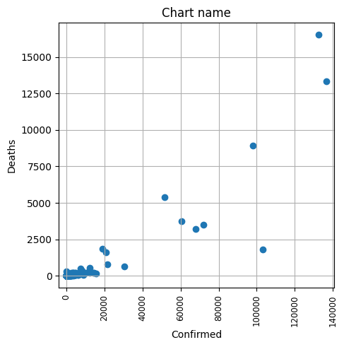
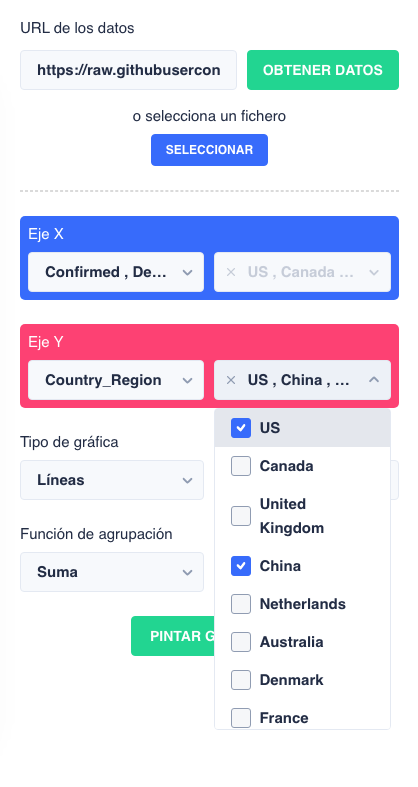
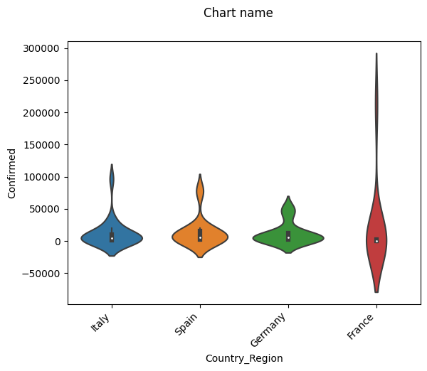
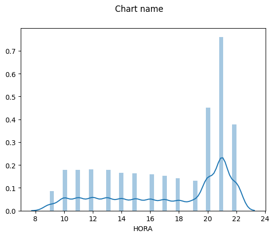
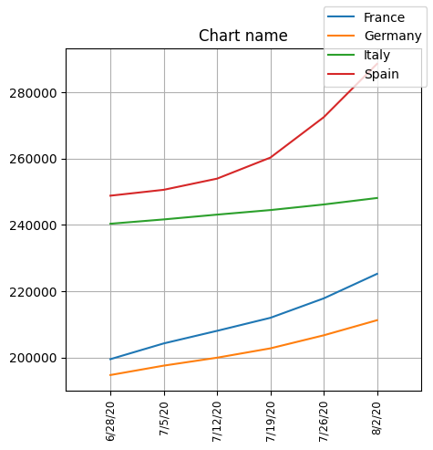
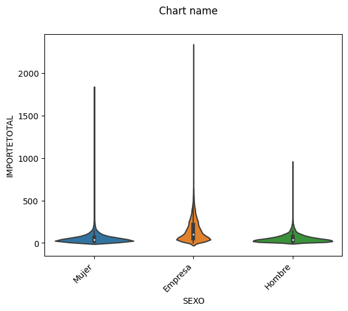
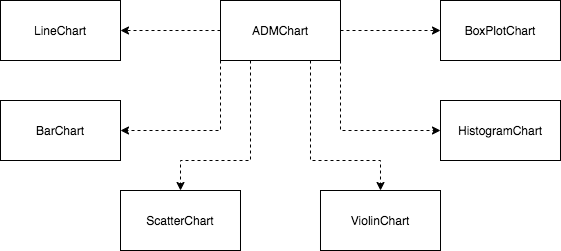

# Visualización de Datos II
Puede acceder a la demo de la aplicación en **[http://edu.ajmonfue.me/adm-3/](http://edu.ajmonfue.me/adm-3/)**

## Tabla de contenido
<!-- START doctoc generated TOC please keep comment here to allow auto update -->
<!-- DON'T EDIT THIS SECTION, INSTEAD RE-RUN doctoc TO UPDATE -->


  - [Enunciados](#enunciados)
    - [1. Para el framework de visualización desarrrollado en la práctica anterior, incorpora las modificaciones planteadas por el profesor durante la sesión de evaluación.](#1-para-el-framework-de-visualizaci%C3%B3n-desarrrollado-en-la-pr%C3%A1ctica-anterior-incorpora-las-modificaciones-planteadas-por-el-profesor-durante-la-sesi%C3%B3n-de-evaluaci%C3%B3n)
      - [Añadir campo al formulario del cliente para indicar la columna de agrupación, útil para las gráficas de dispersión.](#a%C3%B1adir-campo-al-formulario-del-cliente-para-indicar-la-columna-de-agrupaci%C3%B3n-%C3%BAtil-para-las-gr%C3%A1ficas-de-dispersi%C3%B3n)
      - [Añadir otros formatos de las fuentes de datos a representar, por ejemplo `.json`.](#a%C3%B1adir-otros-formatos-de-las-fuentes-de-datos-a-representar-por-ejemplo-json)
      - [Permitir filtrar valores de los ejes](#permitir-filtrar-valores-de-los-ejes)
    - [2. Analiza y familiarízate con la librería Seaborn.](#2-analiza-y-familiar%C3%ADzate-con-la-librer%C3%ADa-seaborn)
    - [3. Incorpora al framework que has desarrollado la posibilidad de generar diagramas que permitan mostrar distribuciones de datos: histogramas, correlogramas, boxplots, curvas de densidad, diagramas de violín...](#3-incorpora-al-framework-que-has-desarrollado-la-posibilidad-de-generar-diagramas-que-permitan-mostrar-distribuciones-de-datos-histogramas-correlogramas-boxplots-curvas-de-densidad-diagramas-de-viol%C3%ADn)
      - [Violin](#violin)
      - [Cajas y bigotes](#cajas-y-bigotes)
      - [Histograma con diagrama de densidad](#histograma-con-diagrama-de-densidad)
    - [4. Con los conjuntos de datos considerados en las prácticas anteriores desarrolla el tratamiento que permita conocer la distribución de datos y extraer información relativa a comportamientos realizando comparativas de algunas variables: edad, país, género, periodos, ...](#4-con-los-conjuntos-de-datos-considerados-en-las-pr%C3%A1cticas-anteriores-desarrolla-el-tratamiento-que-permita-conocer-la-distribuci%C3%B3n-de-datos-y-extraer-informaci%C3%B3n-relativa-a-comportamientos-realizando-comparativas-de-algunas-variables-edad-pa%C3%ADs-g%C3%A9nero-periodos-)
      - [Coronavirus](#coronavirus)
      - [Conjunto de datos para supermercados gourmet](#conjunto-de-datos-para-supermercados-gourmet)
    - [5. Haciendo uso del componente "servidor" desarrollado en la asignatura Computación en la Nube, convierte en un servicio el framework desarrollado. Para poder acceder a este servicio, deberías desarrollar asimismo un cliente específico que permita al usuario seleccionar el origen de los datos que van a ser representados y que en el servidor se realicen las representaciones que serán mostradas por el cliente. Describe en una página la arquitectura software de la aplicación y las tecnologías desarrolladas.](#5-haciendo-uso-del-componente-servidor-desarrollado-en-la-asignatura-computaci%C3%B3n-en-la-nube-convierte-en-un-servicio-el-framework-desarrollado-para-poder-acceder-a-este-servicio-deber%C3%ADas-desarrollar-asimismo-un-cliente-espec%C3%ADfico-que-permita-al-usuario-seleccionar-el-origen-de-los-datos-que-van-a-ser-representados-y-que-en-el-servidor-se-realicen-las-representaciones-que-ser%C3%A1n-mostradas-por-el-cliente-describe-en-una-p%C3%A1gina-la-arquitectura-software-de-la-aplicaci%C3%B3n-y-las-tecnolog%C3%ADas-desarrolladas)
    - [6. Piensa en un nombre y en algún tipo de aplicación para la que pueda desarrollarse el Framework desarrollado.](#6-piensa-en-un-nombre-y-en-alg%C3%BAn-tipo-de-aplicaci%C3%B3n-para-la-que-pueda-desarrollarse-el-framework-desarrollado)
- [Futuras mejoras](#futuras-mejoras)

<!-- END doctoc generated TOC please keep comment here to allow auto update -->

## Enunciados
### 1. Para el framework de visualización desarrrollado en la práctica anterior, incorpora las modificaciones planteadas por el profesor durante la sesión de evaluación.

#### Añadir campo al formulario del cliente para indicar la columna de agrupación, útil para las gráficas de dispersión.
Para las gráficas de lineas y de barras dicho campo está deshabilitado, puesto que su valor se calcula segun el siguiente criterio:
* Si se selecciona sólo un campo para el `eje X`, el campo de agrupación será dicho campo.
* Si se selecciona múltiples campos en el `eje X` y un campo para el `eje Y`, el campo de agrupación corresponderá a este último. Nótese que el script de python fallará en el caso de especificar múltiples campos en ambos ejes.

Por otro lado, si estará habilitado en el caso se seleccione el tipo de gráfica de dispersión.

**Datos**: https://raw.githubusercontent.com/CSSEGISandData/COVID-19/master/csse_covid_19_data/csse_covid_19_daily_reports/04-06-2020.csv
| *Gráfica de dispersión no agrupado* | *Gráfica de dispersión agrupado por país* |
|---|---|
|  |  |

#### Añadir otros formatos de las fuentes de datos a representar, por ejemplo `.json`.
Se añade la importación de datos en formato `json` con la siguiente estructura:
```json
{
    "Country_Region": [
        "US",
        "Spain",
        "Mexico"
    ],
    "Confirmed": [
        100,
        200,
        300
    ],
}
```

#### Permitir filtrar valores de los ejes
Se permite filtrar valores de uno de los ejes, según el siguiente criterio:
* Se permitirá filtrar valores del `eje X`, si se selecciona sólo un campo para el `eje X`.

    **Datos**: https://raw.githubusercontent.com/CSSEGISandData/COVID-19/master/csse_covid_19_data/csse_covid_19_daily_reports/04-06-2020.csv

    | *Formulario de gráfica sin campos filtrados (eje X)* | *Gráfica sin campos filtrados (eje X)* |
    |---|---|
    |  |  |

    | *Formulario de gráfica con campos filtrados (eje X)* | *Gráfica con campos filtrados (eje X)* |
    |---|---|
    |  |  |


* Se permitirá filtrar valores del eje Y, si se selecciona múltiples valores para el `eje X` y un sólo valor para el `eje Y`.

    **Datos**: https://raw.githubusercontent.com/CSSEGISandData/COVID-19/master/csse_covid_19_data/csse_covid_19_daily_reports/04-06-2020.csv

    | *Formulario de gráfica sin campos filtrados (eje Y)* | *Gráfica sin campos filtrados (eje Y)* |
    |---|---|
    |  |  |

    | *Formulario de gráfica con campos filtrados (eje Y)* | *Gráfica con campos filtrados (eje Y)* |
    |---|---|
    |  |  |

### 2. Analiza y familiarízate con la librería Seaborn.
Seaborn es una librería de visualización de datos para Python, desarrollada sobre matplotlib, que permite generar fácilmente elegantes gráficos. Como introducción, se ha seguido el siguiente artículo:
* https://www.analyticslane.com/2018/07/20/visualizacion-de-datos-con-seaborn/#:~:text=Seaborn%20es%20una%20librer%C3%ADa%20para,defecto%20en%20la%20distribuci%C3%B3n%20Anaconda

### 3. Incorpora al framework que has desarrollado la posibilidad de generar diagramas que permitan mostrar distribuciones de datos: histogramas, correlogramas, boxplots, curvas de densidad, diagramas de violín...
Mediante el uso de `seaborn`, en el script en python, se han incorporado los siguientes tipos de gráficas. En la parte del cliente se podrá seleccionar y representar estos tipos de gráficas, sin embargo, por falta de tiempo, no se ha implementado la correspondiente representación en Chart.js, por lo que sólo estarán disponibles los generados por el script en python.

#### Violin
**Datos**: https://raw.githubusercontent.com/CSSEGISandData/COVID-19/master/csse_covid_19_data/csse_covid_19_daily_reports/08-02-2020.csv

Comando:
```
> python main.py --x-axis Country_Region --y-axis Confirmed --chart-type violin --data https://raw.githubusercontent.com/CSSEGISandData/COVID-19/master/csse_covid_19_data/csse_covid_19_daily_reports/08-02-2020.csv --group-by-func sum --x-select Italy Spain Germany France
```

| *Gráfica de violin* |
|---|
|  |

#### Cajas y bigotes
**Datos**: https://raw.githubusercontent.com/CSSEGISandData/COVID-19/master/csse_covid_19_data/csse_covid_19_daily_reports/08-02-2020.csv

Comando:
```
> python main.py --x-axis Country_Region --y-axis Confirmed --chart-type box --data https://raw.githubusercontent.com/CSSEGISandData/COVID-19/master/csse_covid_19_data/csse_covid_19_daily_reports/08-02-2020.csv --group-by-func sum --x-select Italy Spain Germany France
```

| *Gráfica de cajas y bigotes* |
|---|
|  |

#### Histograma con diagrama de densidad
**Fuente original de los datos**: https://www.kaggle.com/acostasg/gourmet-supermarkets?select=analisis_data_o_hora_del_dia.csv
**Fichero**: [assets/data/analisis_data_o_hora_del_dia.csv](assets/data/analisis_data_o_hora_del_dia.csv)

Los datos del fichero difieren de la fuente original en que la primera columna, originalmente, era una cadena vacía, lo cual ocasionaba un error en el cliente, por ello se ha renombrado a `ID`.

Comando (Los datos se pasan por la entrada estándar):
```
> python main.py --x-axis HORA --chart-type histogram --group-by-func sum < analisis_data_o_hora_del_dia.csv
```

| *Gráfica de histograma con [KDE](https://en.wikipedia.org/wiki/Kernel_density_estimation)* |
|---|
|  |

### 4. Con los conjuntos de datos considerados en las prácticas anteriores desarrolla el tratamiento que permita conocer la distribución de datos y extraer información relativa a comportamientos realizando comparativas de algunas variables: edad, país, género, periodos, ...

#### Coronavirus
**Datos**: https://raw.githubusercontent.com/CSSEGISandData/COVID-19/master/csse_covid_19_data/csse_covid_19_time_series/time_series_covid19_confirmed_global.csv

Se pretende analizar y comparar la evolución de casos confirmados de Covid-19 en los países España, Francia, Alemania e Italia entre el rango de fechas desde 28/06/2020 hasta 02/08/2020 cada 7 días. Para ello se ha utilizado la siguiente gráfica de líneas.

| *Evolución de Covid-19* |
|---|
|  |

```bash
> python main.py --x-axis 7/12/20 7/19/20 7/26/20 8/2/20 --y-axis Country/Region --chart-type line --data https://raw.githubusercontent.com/CSSEGISandData/COVID-19/master/csse_covid_19_data/csse_covid_19_time_series/time_series_covid19_confirmed_global.csv --group-by-func sum --y-select Spain France Germany Italy
```

Como se puede ver, todos los paises de la gráfica tienen un aumento de casos confirmados por Covid-19 en este intervalo de tiempo, sin embargo, dicho incremento en España es bastante superior al resto de paises, cuyo crecimiento se ha acelerado en esta últimas dos semanas.


#### Conjunto de datos para supermercados gourmet
**Fuente original de los datos**: https://www.kaggle.com/acostasg/gourmet-supermarkets?select=analisis_data_o_hora_del_dia.csv
**Fichero**: [assets/data/analisis_data_o_hora_del_dia.csv](assets/data/analisis_data_o_hora_del_dia.csv)

Del conjunto de datos indicado, se pretende analizar qué individuos realizan, en general, compras con un importe total más elevado que el resto, y quiénes con un importe menor; de entre mujeres, hombres y empresas (columna `sexo` de los datos). Para ello se va a utilizar una gráfica de violin.

| *Importe total de compras por sexo y empresa* |
|---|
|  |


```bash
> python main.py --x-axis SEXO --y-axis IMPORTETOTAL --chart-type violin --group-by-func sum < analisis_data_o_hora_del_dia.csv
```

Como se puede ver en la gráfica, las empresas son las que realizan compras con un importe total más elevado, y los hombres con un importe total menor.

### 5. Haciendo uso del componente "servidor" desarrollado en la asignatura Computación en la Nube, convierte en un servicio el framework desarrollado. Para poder acceder a este servicio, deberías desarrollar asimismo un cliente específico que permita al usuario seleccionar el origen de los datos que van a ser representados y que en el servidor se realicen las representaciones que serán mostradas por el cliente. Describe en una página la arquitectura software de la aplicación y las tecnologías desarrolladas.

La arquitectura de la aplicación no ha cambiado con respecto a la última entrega, salvo por la incorporación de la librería `seaborn` al script en python, por lo que teniendo esto en cuenta la arquitectura quedaría de la siguiente forma:

|  | 
|:--:| 
| *Arquitectura de aplicación* |

Por otra parte, se han añadido nuevos tipos de gráficos, por lo que el diagrama de clases de gráficas quedaría así:

|  | 
|:--:| 
| *Jerarquía de clases de gráficas* |

### 6. Piensa en un nombre y en algún tipo de aplicación para la que pueda desarrollarse el Framework desarrollado.
La idea de la aplicación en la que se podría desarrollar este framework consiste en el almacenamiento y representación de datos. Mas concretamente, la aplicación tendría, por un parte, la funcionalidad de almacenar datos, algo parecido a [kaggle](https://www.kaggle.com/), pero con el valor añadido que dichos datos pueden se representados en gráficas que el usuario decida. Como es lógico la aplicación tendría que implementar la gestión de usuarios (registro, autenticación, autorización...).

Por otra parte, las gráficas del usuario podrían ser compartidas, mediante `iframe` por ejemplo, de forma que otros sitios web podrían incorporarlos. Sobre dicha compartición se podría implementar un modelo de negocio, puesto que las gráficas podrían ser públicas o estar sujetas a una especie de pago o suscripción para acceder a ellas, según el criterio del usuario.

Por último, como nombre de aplicación he pensado `iochart`.

# Futuras mejoras
* Permitir especificar las dimensiones de la gráfica de matplotlib.
* Permitir descargar imágenes de las graficas.
* Visualización de gráficas en pantalla completa.
* Sincronizar los valores de ejes seleccionados en la tabla. Señalar sólo aquellos seleccionados.
* Utilizar seaborn para las gráficas de líneas, scatter, y barras.
* Crear las gráficas con chart.js en el cliente, análogas a las creadas con seaborn.
* Permitir compartir links con los argumentos necesarios como query strings
