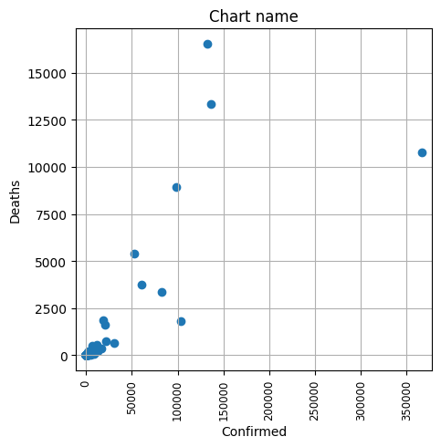
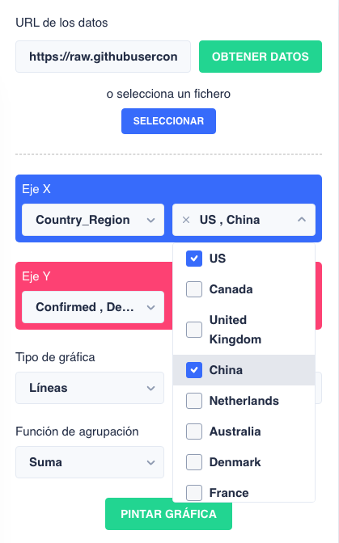
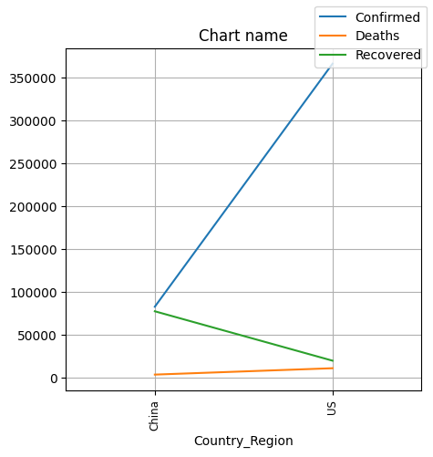
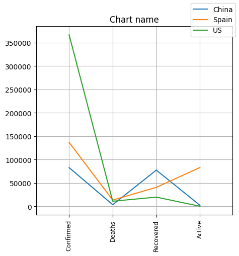

# Visualización de Datos II
Puede acceder a la demo de la aplicación en **[http://edu.ajmonfue.me/adm-3/](http://edu.ajmonfue.me/adm-3/)**

## Enunciados
### 1. Para el framework de visualización desarrrollado en la práctica anterior, incorpora las modificaciones planteadas por el profesor durante la sesión de evaluación.

#### Añadir campo al formulario del cliente para indicar la columna de agrupación, útil para las gráficas de dispersión.
Para las gráficas de lineas y de barras dicho campo está deshabilitado, puesto que su valor se calcula segun el siguiente criterio:
* Si se selecciona sólo un campo para el `eje X`, el campo de agrupación será dicho campo.
* Si se selecciona múltiples campos en el `eje X` y un campo para el `eje Y`, el campo de agrupación corresponderá a este último. Nótese que el script de python fallará en el caso de especificar múltiples campos en ambos ejes.

Por otro lado, si estará habilitado en el caso se seleccione el tipo de gráfica de dispersión.

**Datos**: https://raw.githubusercontent.com/CSSEGISandData/COVID-19/master/csse_covid_19_data/csse_covid_19_daily_reports/04-06-2020.csv
| *Gráfica de dispersión no agrupado* | *Gráfica de dispersión agrupado por país* |
|---|---|
|  |  |

#### Añadir otros formatos de las fuentes de datos a representar, por ejemplo `.json`.
Se añade la importación de datos en formato `json` con la siguiente estructura:
```json
{
    "Country_Region": [
        "US",
        "Spain",
        "Mexico",
        ...
    ],
    "Confirmed": [
        100,
        200,
        300,
        ...
    ],
    ...
}
```

#### Permitir filtrar valores de los ejes
Se permite filtrar valores de uno de los ejes, según el siguiente criterio:
* Se permitirá filtrar valores del `eje X`, si se selecciona sólo un campo para el `eje X`.

**Datos**: https://raw.githubusercontent.com/CSSEGISandData/COVID-19/master/csse_covid_19_data/csse_covid_19_daily_reports/04-06-2020.csv

| *Formulario de gráfica sin campos filtrados (eje X)* | *Gráfica sin campos filtrados (eje X)* |
|---|---|
|  |  |

| *Formulario de gráfica con campos filtrados (eje X)* | *Gráfica con campos filtrados (eje X)* |
|---|---|
|  |  |


* Se permitirá filtrar valores del eje Y, si se selecciona múltiples valores para el `eje X` y un sólo valor para el `eje Y`.

**Datos**: https://raw.githubusercontent.com/CSSEGISandData/COVID-19/master/csse_covid_19_data/csse_covid_19_daily_reports/04-06-2020.csv

| *Formulario de gráfica sin campos filtrados (eje Y)* | *Gráfica sin campos filtrados (eje Y)* |
|---|---|
|  |  |

| *Formulario de gráfica con campos filtrados (eje Y)* | *Gráfica con campos filtrados (eje Y)* |
|---|---|
|  |  |

### 2. Analiza y familiarízate con la librería Seaborn.
Seaborn es una librería de visualización de datos para Python, desarrollada sobre matplotlib, que permite generar fácilmente elegantes gráficos. Como introducción, se ha seguido el siguiente artículo:
* https://www.analyticslane.com/2018/07/20/visualizacion-de-datos-con-seaborn/#:~:text=Seaborn%20es%20una%20librer%C3%ADa%20para,defecto%20en%20la%20distribuci%C3%B3n%20Anaconda

### 3. Incorpora al framework que has desarrollado la posibilidad de generar diagramas que permitan mostrar distribuciones de datos: histogramas, correlogramas, boxplots, curvas de densidad, diagramas de violín...
Se han incoporado los siguientes tipos de gráficos:

#### Violin
**Datos**: https://raw.githubusercontent.com/CSSEGISandData/COVID-19/master/csse_covid_19_data/csse_covid_19_daily_reports/08-02-2020.csv

Comando:
```
> python main.py --x-axis Country_Region --y-axis Confirmed --chart-type violin --data https://raw.githubusercontent.com/CSSEGISandData/COVID-19/master/csse_covid_19_data/csse_covid_19_daily_reports/08-02-2020.csv --group-by-func sum --x-select Italy Spain Germany France
```

| *Gráfica de violin* |
|---|
|  |

#### Cajas y bigotes
**Datos**: https://raw.githubusercontent.com/CSSEGISandData/COVID-19/master/csse_covid_19_data/csse_covid_19_daily_reports/08-02-2020.csv

Comando:
```
> python main.py --x-axis Country_Region --y-axis Confirmed --chart-type box --data https://raw.githubusercontent.com/CSSEGISandData/COVID-19/master/csse_covid_19_data/csse_covid_19_daily_reports/08-02-2020.csv --group-by-func sum --x-select Italy Spain Germany France
```

| *Gráfica de cajas y bigotes* |
|---|
|  |

#### Histograma con diagrama de densidad
**Datos**: https://www.kaggle.com/acostasg/gourmet-supermarkets?select=analisis_data_o_hora_del_dia.csv

Comando (Los datos se pasan por la entrada estándar):
```
> python main.py --x-axis HORA --chart-type histogram --group-by-func sum < analisis_data_o_hora_del_dia.csv
```

| *Gráfica de histograma con [KDE](https://en.wikipedia.org/wiki/Kernel_density_estimation)* |
|---|
|  |


# Futuras mejoras
* Permitir especificar las dimensiones de la gráfica de matplotlib.
* Permitir descargar imágenes de las graficas.
* Visualización en pantalla completa.
* Sincronizar los valores de ejes seleccionados en la tabla. Señalar sólo aquellos seleccionados.
* Utilizar seaborn para las gráficas de líneas, scatter, y barras.
* Crear las gráficas con chart.js en el cliente, análogas a las creadas con seaborn.
* Permitir compartir links con los argumentos necesarios como query strings
